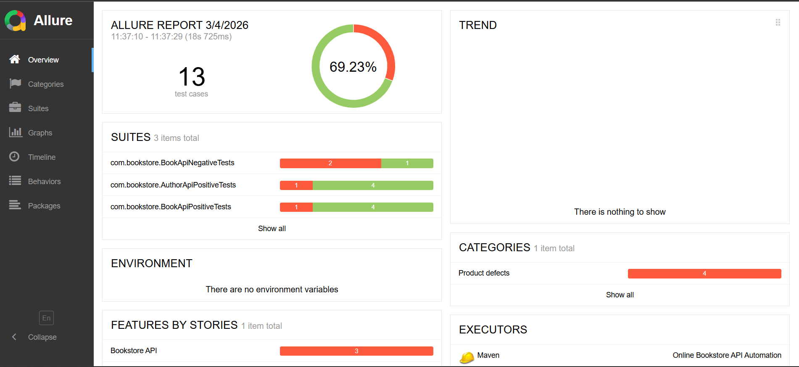
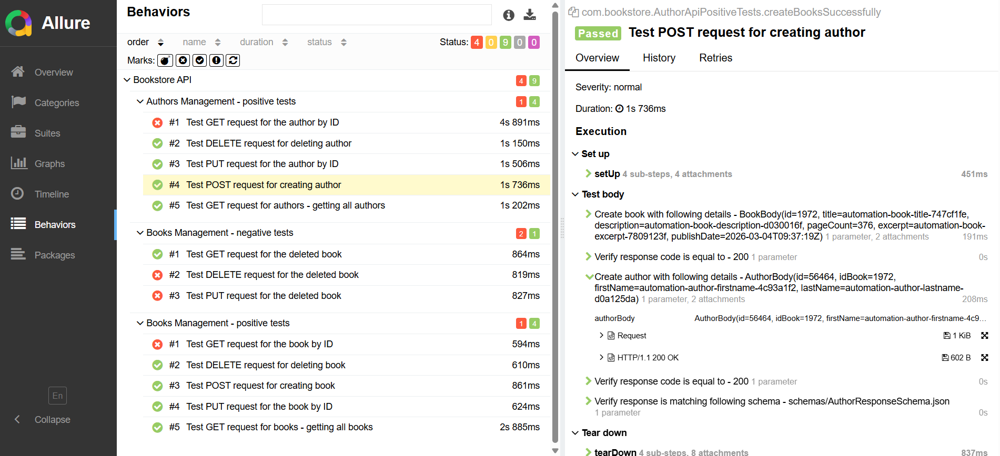
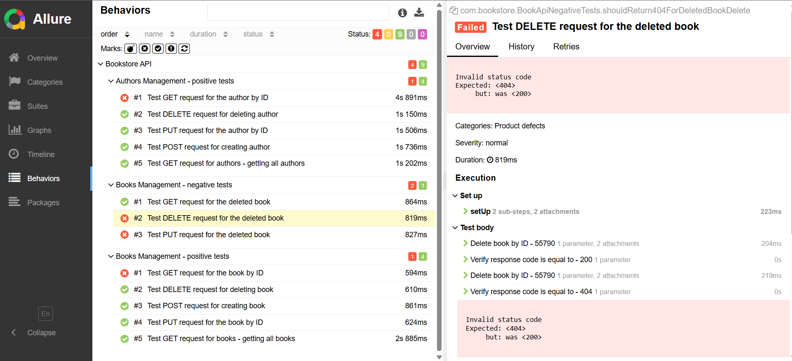

# 📚 Bookstore API Test Automation Framework


## 📌 About the Project
This project is an automated testing framework for the Bookstore REST API.

## 🛠 Tech Stack
* **Language:** Java 21
* **Build Tool:** Maven
* **HTTP Client & Validation:** REST Assured + Hamcrest
* **Testing Framework:** JUnit 5
* **Serialization / Deserialization:** Jackson + Lombok
* **Reporting:** Allure Report

## 🏗 Project Architecture
The project is strictly structured to ensure scalability, maintainability, and readability:
* `models/` — POJO classes (using Lombok `@Builder` and `@Data` for JSON mapping).
* `handlers/` — API clients for specific endpoints (e.g., `BookHandler`). Encapsulates the HTTP request building logic away from the tests.
* `utils/` — Helper classes: test data generation (`DataFactory`), custom assertions (`CustomAsserts`).
* `test/resources/` — Directory for storing JSON schemas used in contract testing.

## 🚀 How to Run Locally

### Prerequisites:
* **JDK 21** installed
* **Apache Maven** installed

### Running against specific environments
By default, if no environment is specified, the tests will run against the **QA** environment. To override the target 
environment, pass the `-Denv` system property via the command line:

```bash
# Run tests on the QA environment (default)
mvn clean test

# Run tests on the DEV environment
mvn clean test -Denv=dev

# Run tests on the PROD environment
mvn clean test -Denv=prod
```

### Generating and viewing the Allure report:
After the tests have finished executing, run the following command to start the web server and view the report:
```bash
mvn allure:serve
```

## ♾️ CI/CD Integration (Azure DevOps)
This project includes a ready-to-use `azure-pipelines.yml` configuration
for integration with Azure DevOps.

### Pipeline Features:
* **Manual Trigger:** The pipeline is configured for manual execution.
* **Environment Selection:** `qa` env is hardcoded within pipeline, but may be refactored into pipeline runtime variables
* **Agents:** Test execution happens on a clean, Microsoft-hosted
  Ubuntu virtual machine (`ubuntu-latest`) running Java 21.
* **Reporting:** The pipeline automatically collects the artifacts and generates a visual report.

> **Note:** To view the Allure Report directly in the Azure DevOps interface,
> ensure that the free **Allure Test Reports** extension is installed in
> your Azure DevOps.

## 📝 Covered Scenarios (Endpoints)
- [x] **POST /Books** — Create a new book.
- [x] **GET /Books** — Retrieve a list of all books.
- [x] **GET /Books/{id}** — Retrieve book by ID.
- [x] **PUT /Books/{id}** — Update an existing book's details.
- [x] **DELETE /Books/{id}** — Delete a book by ID.
- [x] Similar endpoints are covered for the **Authors API**. But each Authors api call also consider creating at least 
one book, because Author is expected to have bookId.
- [x] **GET /Books/{id}**, **PUT /Books/{id}**, **DELETE /Books/{id}** — Negative scenarios for book endpoints.
Test try to get/put/delete book that was already deleted.

> **Note:** **That is not complete list of test scenarios.** These set will show some FW features and approaches
> but doesn't provide complete test coverage with all positive and negative scenarios.

## 💡 Key Features
* **Contract Testing:** Strict JSON Schema validation is performed.
* **Test Isolation:** Every test is completely independent. Test data is generated dynamically on the fly. 
Each book test creates new book before starting, and each author test creates author with book.
* **Smart Cleanup:** The framework tracks entities created during the test execution and automatically safely deletes 
them in the `@AfterEach` teardown block.
* **Environment Configuration** The framework is designed to seamlessly switch between multiple environments 
(e.g., `dev`, `qa`, `prod`) using a custom `ConfigReader` utility and an `application.properties` file.

## 📊 Test Report Preview
The framework utilizes **Allure Report** to generate test execution reports.

Below are static previews of the test results.

### Dashboard Overview
Provides a high-level summary of the test execution, including the overall
pass/fail rate and execution time.



### Detailed Test Scenarios & API Logs
The reports include detailed step-by-step execution for each test case.
REST Assured is integrated with Allure to automatically attach full HTTP
request and response logs (URIs, headers, bodies, status codes) for easy
debugging and trace analysis. <br>
**PASSed test**



**FAILed test**


